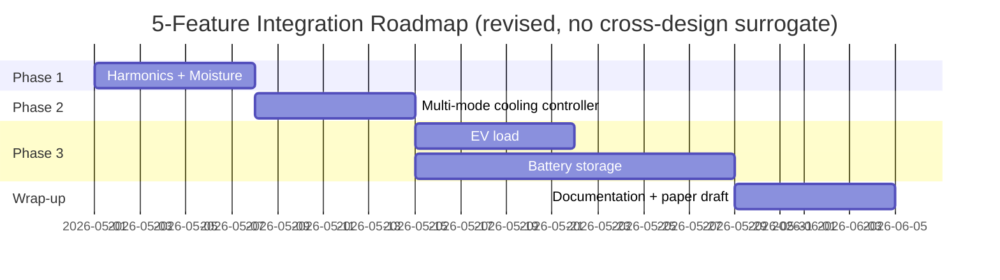

# Roadmap: 5-Feature Integration for transformer_lol_sim

> Plan owner: Fakhri Hakim (PT PLN Persero) · Created: 2026-04-25
> Status: **complete** (all 5 phases implemented, tested, and swept — 2026-04-26)

## Approved Decisions (locked-in)

1. **One PR per phase** — easier to review, easier to revert.
2. **Cross-design surrogate is DROPPED.** Single-design (60 MVA ONAF) surrogate stays.
3. **Battery dispatch:** simple threshold rule (no MPC).
4. **EV charging profiles:** use published European/US patterns (NREL Lawrence Berkeley studies); calibrate by analogy to Indonesian conditions.
5. **Cooling modes:** ONAN and ONAF only. No OFAF, no pump failure mode (only fan failure).

---

## Why This Phasing

The 5 features have hidden dependencies. **Harmonics (#2)** and **moisture (#6)** are isolated additions that establish the "add scenario knob → modify physics → retest" muscle memory before tackling the bigger items. **Multi-mode cooling (#1)** is the largest single-physics change. **Battery (#4)** interacts with PV reverse-flow which is also affected by cooling switching, so battery comes after cooling. **EV (#5)** can run in parallel with battery.

| Phase | Features | Risk | Effort | Why this order |
|-------|----------|------|--------|----------------|
| 1 | #2 Harmonics, #6 Moisture | Low | ~1 week | Quick wins; both are scenario knobs over existing physics |
| 2 | #1 Multi-mode cooling (ONAN/ONAF only) | Medium | ~1.25 weeks | Largest physics change; affects every θ_HS calculation downstream |
| 3 | #5 EV load, #4 Battery | Medium | ~2.5 weeks | New modules; can be parallelised across two contributors |

**Total calendar time:** ~5 weeks sequential, ~3.5 weeks if Phase 3 is parallelised.

---

## Phase 1 — Harmonics + Moisture (Quick Wins)

### 1A. Harmonics (#2)

**Physics.** PV inverter total harmonic distortion (THD) increases stray and eddy losses inside the transformer. Per IEC 61378-1, the load-loss multiplier is approximately:

```
R_eff = R · (1 + 0.5 · THD²)
```

For typical inverter THD = 5% (0.05), the uplift is +0.125% on R — small but always-on. For poor-quality inverters at THD = 15%, the uplift is +1.1% — meaningful at high penetration.

**Files to change:**

| File | Change |
|------|--------|
| `config/scenarios.yaml` | Add `inverter_thd: 0.05` to mc_defaults; allow per-scenario override |
| `src/transformer_lol/scenarios.py` | Add `inverter_thd: float = 0.05` field to `Scenario` dataclass |
| `src/transformer_lol/thermal_model.py` | In `simulate_thermal()` and `steady_state()`, replace `R` with `R_eff = R * (1 + 0.5 * thd**2)` if `thd` arg passed |
| `src/transformer_lol/monte_carlo.py` | Pass `scenario.inverter_thd` through to thermal calls |
| `tests/test_thermal_model.py` | New test: `test_thd_uplift_at_5pct` — verify R_eff = 1.00125 × R |

**Validation:** baseline (`thd=0`) must produce identical results to current code. Bit-exact regression test.

**Effort:** 1–2 days.

### 1B. Moisture-dependent B (#6)

**Physics.** IEEE C57.91-2011 Annex E states the Arrhenius B-constant varies with paper moisture content:

| Moisture (%) | B (K) |
|--------------|-------|
| 0.5 (dry) | 16,054 |
| 1.0 | 15,000 (default) |
| 2.0 | 14,594 |
| 3.0 (wet) | 14,158 |

Higher moisture → lower B → slower aging at low temps but greater swing sensitivity. In Indonesia's wet season (Nov–Mar) the paper absorbs more moisture; this is currently ignored.

**Files to change:**

| File | Change |
|------|--------|
| `config/transformer_60mva.yaml` | Add `moisture_pct_dry_season: 1.0`, `moisture_pct_wet_season: 2.0` |
| `src/transformer_lol/aging.py` | Add `B_from_moisture(moisture_pct) -> float` lookup (linear interp on the 4 fixture points). Modify `aging_acceleration_factor()` to accept optional `B` arg |
| `src/transformer_lol/monte_carlo.py` | Build a per-hour `B_array` based on month-of-year (Nov–Mar = wet, others = dry). Pass to aging calc |
| `tests/test_aging.py` | New tests: `test_b_from_moisture_at_1pct == 15000`; `test_seasonal_b_modulation` |

**Validation:** the *annual mean* LoL with seasonal B should be within 5% of the constant-B result for typical operation. Print both and verify in the script-04 summary.

**Effort:** 3–4 days.

### Phase 1 Exit Gate

- All existing tests pass.
- New tests pass.
- script 04 produces `metrics.json` with two new keys: `headline_with_constant_B`, `headline_with_seasonal_B` for comparison.
- Page 3 of Notion docs updated with the moisture explanation.

---

## Phase 2 — Multi-Mode Cooling Switching (#1, ONAN/ONAF Only)

This is the most invasive physics change. Current model has one fixed cooling mode (ONAF). Real ONAF transformers switch fans on at oil ~70 °C; *unsupervised fan failures* materially affect aging.

### Design

**Two-state controller** integrated into the thermal step:

```
state machine:
  ONAN --(theta_to > 70 and fans_OK)--> ONAF
  ONAF --(theta_to < 60)             --> ONAN (hysteresis)
  ONAF --(stochastic fan failure)    --> ONAN (degraded mode)
```

Each cooling mode has its own `(delta_theta_to_r, tau_to_min, n)` triplet. The controller picks parameters per timestep based on current state. Hysteresis (60–70 °C) prevents rapid mode flapping.

### Files to change

| File | Change |
|------|--------|
| `config/transformer_60mva.yaml` | Add `cooling_states:` block with ONAN/ONAF parameter pairs, hysteresis thresholds (60/70 °C), MTTF for fans |
| `src/transformer_lol/thermal_model.py` | New `CoolingController` class with `.step(theta_to_current, dt_min)` that returns the active params; modify `simulate_thermal()` to consult it inside the ODE RHS |
| `src/transformer_lol/scenarios.py` | New `Scenario` field: `cooling_failure_mode: str = "none"` ∈ `{none, fan_failed}` |
| `src/transformer_lol/monte_carlo.py` | For each MC run, draw fan failure based on MTTF and seed |
| New: `tests/test_cooling_controller.py` | 4 tests: state transitions, hysteresis, fan failure, parameter selection |
| `src/transformer_lol/plotting.py` | New `fig09_cooling_mode_timeline` — overlay cooling mode on θ_TO trajectory for one example day |
| `scripts/05_generate_figures.py` | Wire fig09 |

### IEEE parameter values (from C57.91 Table 4)

| Mode | ΔΘ_TO_R (°C) | τ_TO (min) | n | m |
|------|--------------|------------|-----|-----|
| ONAN | 55 | 240 | 0.8 | 0.8 |
| ONAF | 55 | 150 | 0.8 | 0.8 |

Notice ONAN has the same ΔΘ_TO_R but a 60% longer time constant — fans don't help steady-state, only transient response.

### Validation

- Annex G test still passes (ONAF only, no state transitions).
- New test: simulate K=1.2 ramp from cold; verify mode promotes ONAN → ONAF at θ_TO crossing 70 °C.
- New test: forced `fan_failed` mode at K=1.0, ambient=35 °C → verify θ_HS rises ~10 °C above the OK case.
- Re-run baseline scenario, verify LoL within 5% of current value (fans should usually be on at our load levels).

### Connection to PV scenarios

At 75% PV, midday net load drops to ~0 → θ_TO drops below the 60 °C hysteresis threshold → fans switch *off*. Then evening peak hits at ~0.95 K → θ_TO climbs but lags because fans were just off. This may add ~2 °C to evening hot-spot peaks vs always-on fans. The Phase 2 implementation will quantify this for the first time.

**Effort:** 5–6 days (reduced from 6–8 days because OFAF and pump failure are out of scope).

### Phase 2 Exit Gate

- All Phase 1 tests still pass.
- New cooling controller tests pass.
- fig09 generated and reviewed.
- New row in `table2_lol_statistics.csv`: re-run baseline + pv75_tropical_today; report old-vs-new LoL delta.
- Page 2 of Notion docs updated with the controller design + state diagram.

---

## Phase 3 — EV Load + Battery Storage (Parallelisable)

Both add new behaviour to the LV bus. They can be developed in parallel but should be tested together because they interact (battery may charge from EV-induced overcapacity).

### 3A. EV Charging Load (#5)

**Source for profile shape.** Published US/EU studies — primary references:

- NREL TP-5400-72956 (2019) — *Electric Vehicle Charging Infrastructure Trends*; aggregate slow-charging load shapes.
- LBNL-2001284 (2020) — *Probabilistic Forecasting of EV Charging Loads*; fast-charging arrival distributions.
- IEA Global EV Outlook 2024 — penetration scenarios.

We adopt the *shape* from these (assumed climate-invariant) and scale by Indonesian penetration projections. Document this assumption in the paper.

**Physics.** Two distinct EV charging patterns:

1. **Slow overnight (residential).** Each EV charges for 6–8 hours starting ~22:00 at 3.3–7.4 kW. Aggregated across hundreds of EVs → smooth bell curve centered ~02:00.
2. **Fast opportunistic (commercial).** 50 kW DC fast chargers used randomly throughout the day, lasting 20–40 min each.

The aggregate effect is **deepening the evening peak** (already the worst time for the transformer) and adding **overnight load** (which is when ambient cools and aging is naturally low).

**Files to change:**

| File | Change |
|------|--------|
| `config/scenarios.yaml` | Add `ev_penetration_pu: 0.0` to scenarios; new named scenarios like `pv50_ev30_warmer_2030` |
| `src/transformer_lol/scenarios.py` | New `Scenario` field: `ev_penetration_pu: float = 0.0` |
| New: `src/transformer_lol/ev_load.py` | Two functions: `synthesize_ev_slow(n_hours, penetration_pu, seed)` and `synthesize_ev_fast(n_hours, penetration_pu, seed)`. Returns p.u. arrays. Reference NREL/LBNL shapes in docstring |
| `src/transformer_lol/monte_carlo.py` | Sum EV load into total load before computing net |
| New: `tests/test_ev_load.py` | Shape tests, peak-at-02:00 for slow, no-night-clustering for fast |

**Validation:** at `ev_penetration_pu = 0` the result is identical to the current code (regression). At `0.30`, expect annual LoL to rise 15–25% because EVs add load when there's no PV to offset.

**Effort:** 4–5 days.

### 3B. Battery Storage (#4) — Simple Threshold Rule

**Physics.** A grid-connected battery with operational rules (no MPC):

- **Charge** when `pv > load` (absorb reverse flow) until SoC = 0.90.
- **Discharge** when `load > load_threshold_pu` (e.g. 0.85) until SoC = 0.10.
- **State of Charge (SoC)** clamped to [0.10, 0.90] — degradation-aware bounds.
- **Round-trip efficiency** = 0.90 (10% lost).
- **Per-cycle aging**: each full discharge consumes 1 / 6000 of battery life (LiFePO4 typical).

**Files to change:**

| File | Change |
|------|--------|
| `config/scenarios.yaml` | Add `battery_capacity_mwh: 0.0`, `battery_power_mw: 0.0`, `battery_threshold_pu: 0.85` |
| `src/transformer_lol/scenarios.py` | Three new `Scenario` fields |
| New: `src/transformer_lol/battery.py` | `BatteryParams` dataclass + `dispatch_battery(load_pu, pv_pu, params, transformer_rated_mva) -> dict` returning `{net_load, battery_p_pu, soc, lifetime_used}` |
| `src/transformer_lol/monte_carlo.py` | Insert battery dispatch step between profile gen and thermal sim. Append `battery_lifetime_used`, `battery_cycles` to output |
| New: `tests/test_battery.py` | Tests: idle (capacity=0) is no-op; full charge during reverse flow; SoC bounds; round-trip efficiency |
| `src/transformer_lol/plotting.py` | New `fig10_battery_dispatch_timeline` — load, PV, battery P, SoC over 48 h |

**Validation:** at `battery_capacity_mwh = 0` the result is identical (regression). At `5 MWh / 2 MW battery + 75% PV`, expect:
- Reverse-flow hours drop from 238 → ~50 (battery absorbs)
- Peak θ_HS drops 2–3 °C (peak shaving)
- Annual LoL drops 5–10% vs no-battery 75% PV case

**Effort:** 6–8 days.

### Phase 3 Exit Gate

- All Phase 1+2 tests still pass.
- New EV + battery tests pass.
- 3 new named scenarios added: `pv50_ev30_today`, `pv75_battery5mwh_today`, `pv75_battery5mwh_ev30_warmer_2030`.
- Re-run script 04 + 05; new fig09, fig10 generated.
- Pages 4 + 6 of Notion docs updated with the new modules.

---

## Cross-Cutting Concerns

### Backwards Compatibility

Each phase adds new YAML keys with **safe defaults that reproduce current behaviour** (`thd=0`, `moisture=1.0` constant, no fan failures, `ev_penetration=0`, `battery_capacity=0`). This means:

- Existing user scripts that don't know about new features still work.
- Each phase can be rolled out independently without breaking the previous one.
- The original IEEE ICT-PEP 2026 paper results remain reproducible by running with all-defaults.

### Memory Hygiene

After each phase, save a backup of the current `metrics.json` and `mc_results_all_scenarios.parquet`:

```bash
copy results\metrics.json results\metrics_phase{N}_baseline.json
copy results\tables\mc_results_all_scenarios.parquet results\tables\mc_results_phase{N}_baseline.parquet
```

This lets you compute *delta-vs-baseline* per phase and put it in the paper appendix.

### Testing Strategy

Every phase must hit these green-light checks before merging:

1. **All previous unit tests pass** (regression).
2. **Annex G fixture passes** (physics gate — never break this).
3. **New unit tests pass** (feature gate).
4. **Smoke test**: `python scripts/run_all.py --quick` completes in < 5 minutes.
5. **Re-run baseline scenario**, document delta-vs-prior-phase in PR description.

### Surrogate Note

Because cross-design generalisation is dropped, the existing 60 MVA ONAF surrogate stays. **However**, after Phase 1 and Phase 2 the underlying physics has changed, so the surrogate must be retrained on each phase to reflect:

- Phase 1: harmonic uplift in R, seasonal B variation
- Phase 2: cooling-mode switching dynamics

Retraining is fast (~60 s per cycle) but each phase must run script 03 before script 04 to avoid the surrogate predicting old physics. **Add this as a step in each phase's checklist.**

Phase 3 adds inputs *before* the thermal model (battery dispatch modifies net_load; EV adds to load). The surrogate sees the same `(load, ambient, pv)` interface, so **no surrogate retraining is needed for Phase 3**.

### Documentation Updates

Each phase ends with a Notion docs update:

| Phase | Pages to update |
|-------|----------------|
| 1 | Page 3 (aging — moisture), Page 9 (config keys), Page 11 (mark items done) |
| 2 | Page 2 (thermal — multi-mode), Page 8 (fig09), Page 9 (config), Page 11 |
| 3 | Page 4 (profiles — EV), new pages on battery + EV?, Page 6 (MC — new metrics), Page 8 (fig10), Page 11 |

---

## Suggested Calendar



Total: **~5 weeks elapsed time** for a single contributor sequential, **~4 weeks** if Phase 3 EV and Battery run in parallel.

---

## Per-Phase PR Checklist Template

Copy this into the PR description for every phase:

```markdown
## Phase N — [feature name]

### Code changes
- [ ] Source files modified per ROADMAP.md Phase N table
- [ ] New unit tests added under tests/
- [ ] YAML config defaults preserve existing behaviour

### Validation
- [ ] All previous tests pass (`pytest tests/ -v`)
- [ ] Annex G fixture passes (`python scripts/01_validate_thermal.py`)
- [ ] New tests pass
- [ ] `python scripts/run_all.py --quick` completes in < 5 min
- [ ] Surrogate retrained if Phase 1 or 2 (see Cross-Cutting Concerns)
- [ ] Baseline scenario re-run; delta-vs-prior-phase documented

### Documentation
- [ ] Notion pages listed in ROADMAP table updated
- [ ] CHANGELOG entry added (if we adopt one)
- [ ] Backup of prior metrics.json saved as metrics_phaseN_baseline.json
```

---

## Phase 4 — PyPSA Migration + Jember Case Study (added 2026-04-27)

**Status: complete (code) · Notion docs pending**

PyPSA (de-facto Python power-system standard) added as the data-model layer
alongside the existing custom dispatch.  Case study moves from Jakarta to
**Jember (East Java)** at lat=−8.17°, lon=113.70°.  See full design in the
saved plan file `~/.claude/plans/claude-code-prompt-purring-fiddle.md`.

| Sub-phase | Deliverable | State |
|-----------|-------------|-------|
| 4A | `pypsa_network.build_pypsa_network()` builds the 2-bus HV/MV network; 9 unit tests | Done |
| 4B | `pypsa_dispatch.dispatch_battery_pypsa_lp()` (HiGHS LP); `Scenario.dispatch_method` flag; `scripts/06_compare_dispatch_methods.py`; `fig11_dispatch_comparison`, `fig12_pypsa_network` | Done |
| 4C | `data_jember.py` with atlite/BMKG/PLN loaders + Jember-tuned synthesis fallback; `synthesize_eastjava_load()`; ambient defaults switched to Jember; 14 new unit tests | Done |
| 4D | Surrogate retrained on Jember training set; full MC re-sweep (threshold path, 41 scenarios × 1000 runs); LP comparison at n_runs=100; 12/12 figures regenerated | Done |

**Key finding from Phase 4B:**  Vanilla economic-dispatch LP gives marginally
*higher* LoL than the threshold heuristic because it minimises slack-import
cost rather than peak θ_HS.  The threshold rule (discharge above 0.85 pu only)
happens to be near-optimal for transformer aging.  This is a reportable
finding: aging-aware LP would need a non-linear thermal proxy in the
objective.

**Phase 4D results (2026-04-27):**
- Surrogate RMSE = 0.2303 °C (gate: < 1.5 °C ✅), R² = 0.9998 (gate: > 0.99 ✅)
- Jember baseline LoL = 0.0342 %/yr (vs Jakarta 0.0584 %/yr — 41 % lower, cooler ambient)
- Dispatch comparison (`pv75_battery5mwh_today`): LP 0.02760 % vs threshold 0.02728 % (+1.2 %)
- 12/12 figures, 3/3 tables; tests 82/82 pass.

**Tests:** 82/82 pass (49 prior + 33 new).

