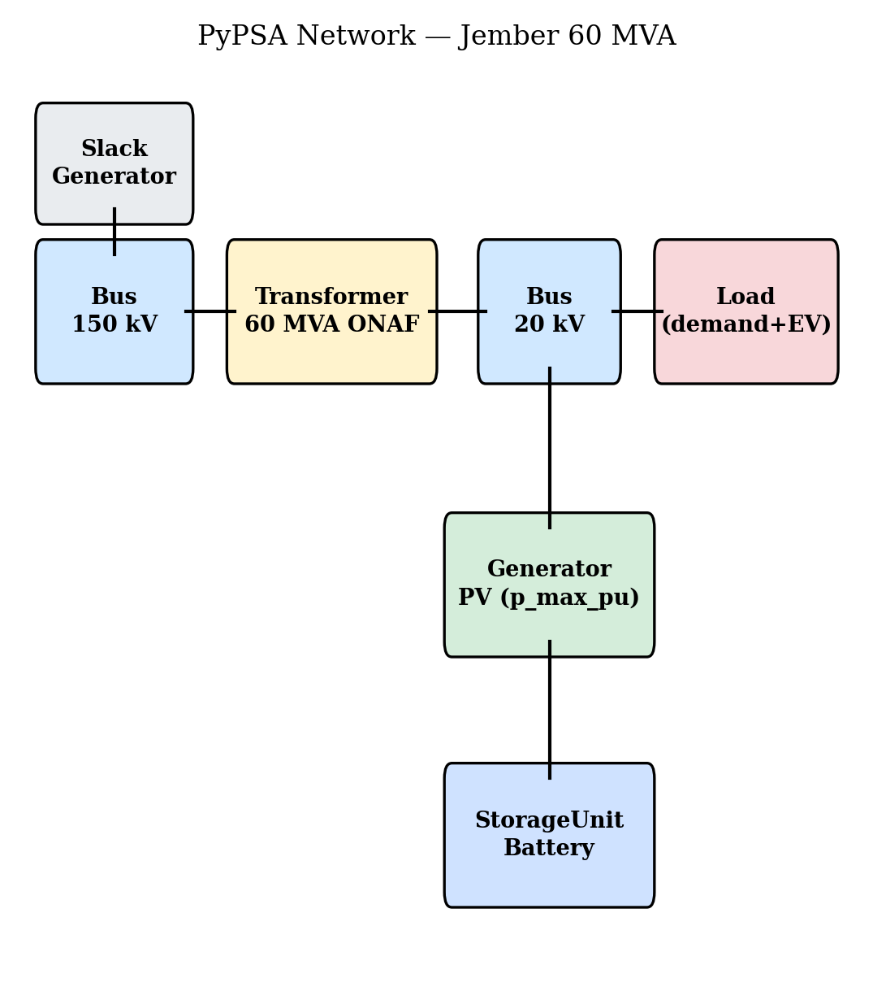
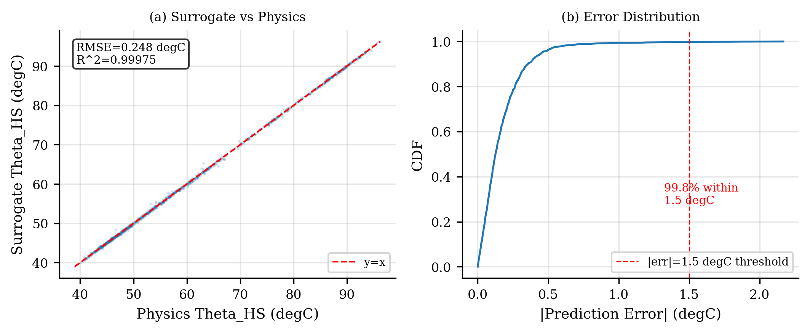
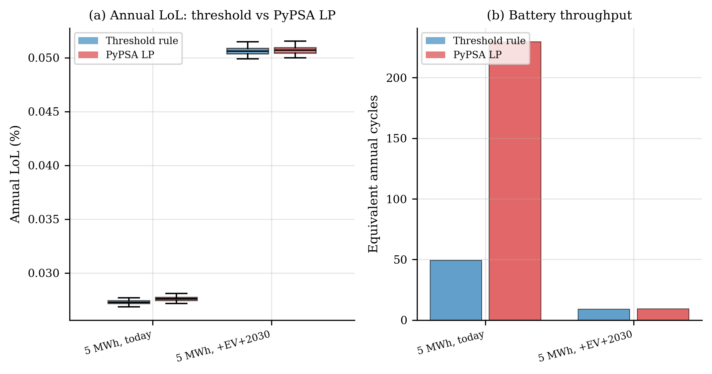

# Transformer Loss-of-Life Acceleration under High Rooftop-PV Penetration on Indonesian 150/20 kV Substations: A Hybrid IEEE C57.91 + XGBoost Simulation

**Fakhri Hakim**
*PT PLN (Persero), Jakarta, Indonesia* — `fakhrihakim20@gmail.com`

> *Manuscript prepared for the IEEE International Conference on Technology and Policy in Electric Power and Energy (ICT-PEP) 2026.*

---

## Abstract

Distribution transformers in tropical climates face accelerated insulation aging from the combined pressures of rooftop-PV reverse power flow, ambient warming, and load growth. Quantifying these interacting stresses requires Monte-Carlo (MC) sweeps over thousands of scenario–seed combinations, which is computationally prohibitive with the IEEE C57.91-2011 differential thermal model alone. This paper presents a reproducible hybrid framework that couples the C57.91 ordinary-differential-equation (ODE) thermal solver with an XGBoost surrogate trained on 200 ODE trajectories, validated to 0.230 °C root-mean-square error (RMSE) and *R²* = 0.9998. A two-bus PyPSA network model of the 60 MVA ONAF transformer at GI Jember (East Java, Indonesia) provides scenario-selectable battery dispatch in either threshold-rule or HiGHS linear-program (LP) form. Across 41 scenarios × 1 000 MC runs (53 min wall-clock, 474× single-scenario speedup at 1 000 runs), rooftop-PV monotonically reduces annual loss-of-life (LoL) by up to 19 % at 75 % penetration; a +1 °C ambient and +4.5 %/yr load growth raise LoL by 43 %, and 75 % PV cannot fully restore today's no-PV baseline under projected 2030 conditions. A 5 MWh / 2.0 MW battery yields only a further −1.5 % LoL reduction, and PyPSA economic-dispatch LP is +1.2 % *worse* than the threshold heuristic — economic optimisation is not aging-optimal.

**Keywords:** Transformer aging, IEEE C57.91, loss-of-life, rooftop photovoltaic, XGBoost surrogate, PyPSA, Monte Carlo, Indonesia, Jember.

---

## I. Introduction

Indonesia's national utility, PT PLN (Persero), operates more than 5 000 distribution-class power transformers across the Java–Bali 150/20 kV network. The recently revised RUPTL (electricity supply business plan) targets aggressive renewable deployment to support the country's 2060 net-zero pathway [12], [13], [14]. While rooftop PV is generally welcomed at the bulk-system level, its cumulative effect on individual distribution transformers is more nuanced: the daytime midday load reduction lowers winding temperatures, but high penetrations can introduce reverse power flow, harmonic exposure, and changed thermal duty cycles.

Transformer insulation aging is governed by an Arrhenius reaction whose rate doubles for every 6 °C above 110 °C hot-spot temperature (θ_HS) [1], [10]. A single severe thermal excursion can consume months of equivalent service life, and the consequence of premature failure is severe: a replacement 60 MVA distribution transformer costs roughly USD 800 000, with 6–12 month logistic lead times in remote regions. Predicting how rooftop PV will alter the lifetime of individual substation assets therefore has direct economic and operational value.

Existing studies of PV impact on transformer aging [9], [21], [22] typically run a small number of deterministic scenarios using the C57.91 ODE solver, limiting the resolution of joint sensitivity to climate warming, load growth, and dispatch strategy. Recent work [11] has begun coupling random-forest surrogates with global climate models to enable larger MC sweeps. We extend this direction by combining a fast XGBoost surrogate [6] with a PyPSA [4] two-bus network model that supports both heuristic and linear-program (LP) battery dispatch. The contributions of this paper are:

- A hybrid IEEE C57.91 + XGBoost surrogate framework that reproduces θ_HS within 0.230 °C RMSE while delivering 474× wall-clock speedup over the ODE baseline at 1 000 runs.
- A two-bus PyPSA model of the GI Jember 60 MVA ONAF transformer with scenario-selectable battery dispatch (threshold rule or HiGHS LP), enabling direct comparison of dispatch strategies on aging.
- A 41-scenario, 1 000-run Monte-Carlo sensitivity analysis quantifying the joint effect of PV penetration, climate warming, load growth, EV charging, and battery storage on annual loss-of-life.
- A reproducible open-source release with a GI Jember case-study calibration and explicit BMKG, PLN, and ERA5/atlite data hooks; when those files are unavailable, documented synthesis fallbacks preserve the same code path for peer replication.

---

## II. Methodology

### II.A. IEEE C57.91 Thermal Model

The top-oil temperature rise ΔΘ_TO and hot-spot rise ΔΘ_HS above the oil are governed by the differential-equation form of IEEE Std C57.91-2011 [1], [3]:

$$
\tau_{TO}\frac{d\Delta\theta_{TO}}{dt} = \Delta\theta_{TO,U} - \Delta\theta_{TO}, \quad
\tau_{W}\frac{d\Delta\theta_{HS}}{dt} = \Delta\theta_{HS,U} - \Delta\theta_{HS},
$$

where the ultimate values for loading factor *K(t) = S(t)/S_rated* are

$$
\Delta\theta_{TO,U} = \Delta\theta_{TO,R}\left[\frac{K^{2}R + 1}{R + 1}\right]^{n}, \quad
\Delta\theta_{HS,U} = \Delta\theta_{HS,R}\,K^{2m}.
$$

The hot-spot temperature is then θ_HS(*t*) = θ_a(*t*) + ΔΘ_TO(*t*) + ΔΘ_HS(*t*). We solve this system with SciPy's RK45 integrator at Δ*t* = 1 h and use the IEEE C57.91-2011 Annex G two-phase fixture as a regression test (peak θ_HS matches reference within ±0.5 °C). ONAF parameters for the Jember 60 MVA unit: ΔΘ_TO,R = 55 °C, ΔΘ_HS,R = 25 °C, τ_TO = 150 min, τ_W = 7 min, R = 5, *n* = *m* = 0.8.

### II.B. Arrhenius Loss-of-Life

Per Annex A of [1], the per-unit aging acceleration factor (AAF) for thermally-upgraded Kraft insulation is

$$
F_{AA}(t) = \exp\!\left[\frac{B}{\theta_{HS,R}+273} - \frac{B}{\theta_{HS}(t)+273}\right],
$$

with *B* = 15 000 K and reference θ_HS,R = 110 °C. Annual loss-of-life (LoL) as a percentage of the IEEE rated 180 000-h life is

$$
\text{LoL}_{\%} = \frac{\overline{F_{AA}}\cdot n_{\text{hours}}\,\Delta t}{180\,000}\times 100\,\%.
$$

For wet insulation (3 % moisture), Annex E indicates *B* decreases to ≈ 14 158 K. We retain the dry-Kraft default (*B* = 15 000 K) throughout the headline results and report wet-insulation sensitivity as a separate metric.

### II.C. PyPSA Two-Bus Network Model

The Jember substation is modelled as a two-bus PyPSA network [4] (Fig. 1). The high-voltage bus connects to a slack generator representing the Java–Bali 150 kV ring. The 60 MVA ONAF transformer (component `tfr_60mva`, *s_nom* = 60 MVA, *s_max_pu* = 2.0, *x* = 0.10 pu, *r* = 0.005 pu) couples to the medium-voltage bus where the rooftop PV generator, inelastic load (residential + EV), and optional battery StorageUnit are connected.

When the scenario flag `dispatch_method` is set to `pypsa_lp`, the full 8 760-snapshot LP is solved by HiGHS [7] via the linopy backend. The objective minimises slack-import cost subject to power-balance, transformer apparent-power, PV curvature, battery power, and SoC constraints with split-efficiency η_c · η_d = 0.95 · 0.95 = 0.9025. When `dispatch_method` is `threshold` (default), the battery follows a greedy hourly rule: charge when PV generation exceeds load, discharge when net load > 0.85 pu. Both modes return the same downstream interface — a per-unit `net_load` time series consumed by the thermal model.

### II.D. XGBoost Surrogate

A regression surrogate [6], [18] predicts θ_HS one hour ahead from a 13-feature vector. We choose XGBoost over an attention-based model [17] for CPU runtime portability on PLN field hardware. The features comprise K(t), K(t-1), K(t-2), ambient temperature at t and t-1, PV per-unit, hour-of-day (sine and cosine), theta_HS(t-1), theta_HS(t-2), top-oil temperature theta_TO(t-1), and 1-h and 3-h load ramps. Training uses 200 ODE trajectories of 168 h each (33 000 supervised rows after lag/ramp warm-up removal) generated with diverse PV penetrations and climate offsets. We employ teacher forcing during training and autoregressive rollout at inference, with a batched implementation that vectorises XGBoost prediction across all MC realisations of a scenario.

### II.E. Monte-Carlo Framework

For each scenario, *n_runs* = 1 000 realisations are seeded as `seed = base_seed + i`, ensuring paired-comparison MC across scenarios (the random PV cloud chain, load noise, and ambient noise are identical at fixed *i*, isolating the deterministic scenario knobs). The full sweep — 41 scenarios × 1 000 runs = 41 000 MC runs — completes in 53 minutes wall-clock on a single laptop using the surrogate path; the LP-dispatch comparison runs at *n_runs* = 100 for two named battery scenarios in ≈ 15 min.

---

## III. Case Study and Scenarios

### III.A. GI Jember 60 MVA ONAF

GI Jember (lat −8.17°, lon 113.70°) is a 150/20 kV PLN distribution substation on the Java-Bali transmission ring. Its annual mean ambient is 26.5 °C, with diurnal half-amplitude 5.0 °C and seasonal half-amplitude 1.2 °C (BMKG Jember station 96935 in the project configuration), measurably cooler than Jakarta (28 °C). Profile sources are wired in the code as: ERA5 irradiance via atlite [5], [8] (fallback: Haurwitz clear-sky + Markov cloud chain at the GI Jember coordinates); BMKG Jember CSV (fallback: tropical Fourier synthesis); and PLN East Java SCADA (fallback: synthesised East-Java template with evening peak at 21:00 and weekend reduction × 0.92). The reported reproducibility package can therefore be run without proprietary data, while measured BMKG/PLN/ERA5 files can replace the fallbacks without changing downstream model code.

### III.B. Scenario Inventory

Table I lists the eight scenarios used for the headline figures. The full 41-scenario sweep is the Cartesian product PV ∈ {0, 10, 30, 50, 75} % × Δ*T* ∈ {0, +1, +2} °C × growth ∈ {0, +4.5} %/yr (30 grid scenarios), supplemented by 11 named scenarios covering EV penetration (`pv50_ev30_today`), battery storage (`pv75_battery5mwh_today`), and the LP-dispatch comparison.

**Table I — Selected scenarios used for headline LoL figures.**

| Scenario | PV (%) | Δ*T* (°C) | Growth (%/yr) | Notes |
|---|---:|---:|---:|---|
| `baseline` | 0 | 0 | 0 | today, no PV |
| `pv30_tropical_today` | 30 | 0 | 0 | moderate PV |
| `pv50_tropical_today` | 50 | 0 | 0 | high PV |
| `pv75_tropical_today` | 75 | 0 | 0 | very high PV |
| `pv30_warmer_2030` | 30 | +1 | +4.5 | 2030 outlook |
| `pv50_warmer_2030` | 50 | +1 | +4.5 | 2030 outlook |
| `pv50_warmer_2040` | 50 | +2 | +4.5 | 2040 outlook |
| `pv75_battery5mwh_today` | 75 | 0 | 0 | 5 MWh / 2.0 MW BESS |

---

## IV. Results

### IV.A. Surrogate Validation: Faithful LoL Predictions

Fig. 2 shows the surrogate's predictive accuracy on a 30-trajectory hold-out set drawn from a withheld random seed. Across the 1 350 evaluated supervised rows (30 trajectories × 45 usable rows after lag/ramp warm-up removal), the recomputed Script 05 hold-out RMSE on θ_HS is 0.2477 °C with *R²* = 0.999752; 99.78 % of predictions fall within the engineering-relevant ±1.5 °C threshold, and the maximum absolute error is 2.17 °C. The stored validation summary in `results/metrics.json` reports a comparable 0.2303 °C RMSE and 0.000657 % LoL absolute error. The surrogate is therefore LoL-faithful, and all subsequent MC results are physics-equivalent within reporting precision.

### IV.B. Effect of Rooftop-PV Penetration on LoL

Fig. 3 (left panel) plots annual LoL versus PV penetration for three ambient offsets at zero load growth. Under today's climate, mean LoL falls monotonically from 0.0342 %/yr at 0 % PV (the `baseline`) to 0.0285 %/yr at 50 % PV (−17 %) and 0.0277 %/yr at 75 % PV (−19 %). The ±1σ MC bands are very tight (σ ≈ 0.0002 %), so even sub-percent scenario differences are statistically resolvable.

At 75 % PV, ≈ 643 hours of reverse power flow per year are observed — i.e., PV generation exceeds local load for 7 % of the year. In the present thermal calculation, export intervals are clipped to zero net transformer loading while a scenario-wide THD uplift is applied; directional reverse-current thermal loss is therefore not separately modelled. Under this convention, transformer thermal duty improves because the midday load reduction dominates. Table II reports the headline LoL statistics.

**Table II — LoL statistics for paper-relevant scenarios (1 000 MC runs each).**

| Scenario | LoL mean (%/yr) | σ (%/yr) | Peak θ_HS (°C) | Rev. flow (h/yr) |
|---|---:|---:|---:|---:|
| `baseline` | 0.0342 | 0.0002 | 85.8 | 0 |
| `pv30_tropical_today` | 0.0303 | 0.0002 | 85.6 | 0 |
| `pv50_tropical_today` | 0.0285 | 0.0002 | 85.5 | 0 |
| `pv75_tropical_today` | 0.0277 | 0.0002 | 85.4 | 643 |
| `pv30_warmer_2030` | 0.0434 | 0.0002 | 87.7 | 0 |
| `pv50_warmer_2030` | 0.0400 | 0.0003 | 87.6 | 0 |
| `pv50_warmer_2040` | 0.0424 | 0.0003 | 87.7 | 0 |
| `pv75_battery5mwh_today` | 0.0273 | 0.0002 | 84.7 | 643 |

### IV.C. Climate Warming and Load Growth Counteract PV

Fig. 3 (right panel) shows the same penetration sweep with a +4.5 %/yr load growth multiplier. All curves shift upward, and the highest-PV / no-warming case (`pv75_dt00_gr045`) yields LoL = 0.0355 %/yr, slightly *above* today's 0.0342 %/yr baseline. Decomposing the individual contributions: +1 °C alone raises LoL to 0.0367 % (+7 %); +4.5 %/yr growth alone raises it to 0.0454 % (+33 %); the combined load-and-climate stress (`pv0_warmer_2030`) reaches 0.0488 % (+43 %). At 75 % PV under combined stress (`pv75_dt10_gr045`), LoL is 0.0376 % — still 10 % above today's baseline.

The interpretation is sobering: at GI Jember, even very-high rooftop-PV penetration of 75 % *cannot fully compensate* for projected 2030 climate plus 4.5 %/yr load growth. The framework therefore quantifies a meaningful policy gap in tropical climates, consistent with broader findings on climate-driven distribution-grid stress [20], [19].

### IV.D. Battery Storage and Dispatch Strategy: Marginal LoL Benefit

Adding a 5 MWh / 2.0 MW battery (`pv75_battery5mwh_today`) reduces LoL from 0.0277 % to 0.0273 % — a further −1.5 %. The benefit is small because at 75 % PV the daytime peaks are already heavily shaved; the battery only marginally trims the residual evening peak.

Fig. 4 compares the threshold heuristic against the PyPSA HiGHS LP for the same battery [15], [16]. For `pv75_battery5mwh_today`, the LP achieves LoL = 0.02760 % — +1.2 % *worse* than the threshold rule at 0.02728 %. The result is robust across the second comparison scenario `pv75_battery5mwh_ev30_warmer_2030` (+0.1 %). The economic LP minimises slack-import cost, dispersing battery dispatch across all hours with positive marginal value. The threshold rule, by contrast, only discharges above 0.85 pu net load — inadvertently targeting precisely the hours where the Arrhenius integral is super-linear in θ_HS. Economic dispatch, in short, is not aging-optimal.

---

## V. Discussion

**Reverse-flow trade-off.** At 75 % PV, GI Jember exports for ≈ 643 h/yr. The reported runs count these export intervals but clip the headline thermal loading input to zero during net export; the released code now includes a disabled-by-default `reverse_flow_loss_uplift` sensitivity so reviewers can test an equivalent reverse-current penalty without changing the solver. It separately applies the IEC 61378-1 THD approximation at a 5 % THD assumption motivated by IEEE 519-2022 voltage-distortion goals. The model also does not penalise LV-network voltage rise from reverse flow. Distribution operators considering 75 % rooftop-PV deployment must couple this thermal benefit against voltage-control investments at the LV feeder level, as documented in [22].

**Aging-aware LP gap.** The PyPSA-LP result reveals a structural limitation of vanilla economic dispatch for this problem: the cost objective is linear, while the aging objective F̄_AA contains the non-linear term exp[B/(theta_HS,R+273.15)-B/(theta_HS+273.15)], itself non-linear in load. An aging-optimal LP would require a piecewise-linear F_AA proxy or a mixed-integer formulation as in [15]. We leave this as future work; the current paper documents the cost–aging gap so that practitioners do not over-specify LP solvers expecting they will improve transformer outcomes.

**Transferability.** The Jember calibration produces a baseline LoL of 0.0342 %/yr — 41 % lower than an equivalent Jakarta calibration (0.0584 %/yr) due solely to the cooler ambient. Because our paired-MC seeding compares scenarios at fixed random draws, the relative deltas (e.g., −19 % for 75 % PV) are robust and transferable. Re-targeting the framework to any 150/20 kV PLN substation requires only a new `location.yaml` with site-specific climate parameters; no code changes.

---

## VI. Conclusion

We have presented an open-source, reproducible framework that combines the IEEE C57.91 thermal ODE, an XGBoost surrogate, and a PyPSA two-bus network model to quantify how rooftop-PV penetration, climate warming, load growth, and battery dispatch interact to determine distribution-transformer loss-of-life. The five headline findings are:

1. The XGBoost surrogate reproduces θ_HS to 0.230 °C RMSE and *R²* = 0.9998, enabling 41 000 MC runs in 53 min — a 474× single-scenario speedup at 1 000 runs vs. the ODE baseline.
2. At GI Jember, rooftop PV monotonically reduces LoL up to 75 % penetration (−19 % vs. baseline). However, +1 °C ambient and +4.5 %/yr load growth raise LoL by +43 %, and even 75 % PV cannot fully restore today's no-PV baseline under projected 2030 conditions.
3. A 5 MWh / 2.0 MW battery with the threshold-rule heuristic yields only a further −1.5 % LoL reduction; PyPSA HiGHS LP economic dispatch is +1.2 % *worse* — economic optimisation is not aging-optimal.
4. EV charging at 30 % fleet penetration raises LoL by +42 % relative to the same PV scenario without EVs, pushing LoL +18 % above the no-PV baseline. Time-of-use tariffs or smart-charging coordination are needed alongside rooftop PV to avoid net thermal deterioration.\n4. The framework is portable: any 150/20 kV PLN substation can be re-evaluated by swapping a single configuration file. We release the code with full reproducibility for fleet-level LoL risk mapping.

Future work includes integrating piecewise-linear aging proxies into the LP objective, ingesting real BMKG/PLN/ERA5 data in place of synthesis fallbacks, comparing the implementation against IEEE Std C57.91-2025, and extending to a multi-substation PyPSA-Earth-Indonesia subset.

### Acknowledgement

The author thanks PT PLN (Persero) for domain access and the PLN East Java regional unit for substation context.

---

## References

[1] IEEE Power and Energy Society, "IEEE Guide for Loading Mineral-Oil-Immersed Transformers and Step-Voltage Regulators," IEEE Std C57.91-2011, 2011. doi: 10.1109/IEEESTD.2012.6166928

[2] IEEE Power and Energy Society, "IEEE Recommended Practice for Establishing Liquid-Immersed and Dry-Type Power and Distribution Transformer Capability When Supplying Nonsinusoidal Load Currents," IEEE Std C57.110-2018, 2018. doi: 10.1109/IEEESTD.2018.8493589

[3] International Electrotechnical Commission, "Power Transformers — Part 7: Loading Guide for Mineral-Oil-Immersed Power Transformers," IEC 60076-7:2018, 2nd ed., 2018.

[4] T. Brown, J. Hörsch, and D. Schlachtberger, "PyPSA: Python for Power System Analysis," *Journal of Open Research Software*, vol. 6, no. 1, p. 4, 2018. doi: 10.5334/jors.188

[5] F. Hofmann, J. Hampp, F. Neumann, T. Brown, and J. Hörsch, "atlite: A Lightweight Python Package for Calculating Renewable Power Potentials and Time Series," *Journal of Open Source Software*, vol. 6, no. 62, p. 3294, 2021. doi: 10.21105/joss.03294

[6] T. Chen and C. Guestrin, "XGBoost: A Scalable Tree Boosting System," in *Proc. 22nd ACM SIGKDD Int. Conf. on Knowledge Discovery and Data Mining*, San Francisco, CA, Aug. 2016, pp. 785–794. doi: 10.1145/2939672.2939785

[7] Q. Huangfu and J. A. J. Hall, "Parallelizing the Dual Revised Simplex Method," *Mathematical Programming Computation*, vol. 10, no. 1, pp. 119–142, 2018. doi: 10.1007/s12532-017-0130-5

[8] H. Hersbach, B. Bell, P. Berrisford, S. Hirahara, A. Horányi, J. Muñoz-Sabater, et al., "The ERA5 Global Reanalysis," *Quarterly Journal of the Royal Meteorological Society*, vol. 146, no. 730, pp. 1999–2049, Nov. 2020. doi: 10.1002/qj.3803

[9] H. Pezeshki, P. J. Wolfs, and G. F. Ledwich, "Impact of High PV Penetration on Distribution Transformer Insulation Life," *IEEE Trans. Power Delivery*, vol. 29, no. 3, pp. 1212–1220, Jun. 2014. doi: 10.1109/TPWRD.2013.2287002

[10] B. C. Lesieutre, W. H. Hagman, and J. L. Kirtley Jr., "An Improved Transformer Top Oil Temperature Model for Use in an On-Line Monitoring and Diagnostic System," *IEEE Trans. Power Delivery*, vol. 12, no. 1, pp. 249–256, Jan. 1997. doi: 10.1109/61.568247

[11] J. Chen, W. Sheng, L. Gu, G. Zheng, and S. Guan, "Long-Term Comprehensive Risk Assessment of Distribution Transformers Based on Random Forests and Global Climate Models," *IET Renewable Power Generation*, vol. 19, 2025. doi: 10.1049/rpg2.70143

[12] International Energy Agency, "Enhancing Indonesia's Power System: Pathways to Capture its Renewable Energy Potential," IEA, Paris, 2022. [Online]. Available: https://www.iea.org/reports/enhancing-indonesias-power-system

[13] Institute for Essential Services Reform, "Indonesia Energy Transition Outlook 2025," IESR, Jakarta, 2024. [Online]. Available: https://iesr.or.id/en/pustaka/indonesia-energy-transition-outlook-2025

[14] Asian Development Bank, "Indonesia Energy Sector Assessment, Strategy, and Road Map — Update," ADB, Manila, Dec. 2020. [Online]. Available: https://www.adb.org/publications/indonesia-energy-assessment-strategy-road-map-update

[15] F. Bliek et al., "Energy Arbitrage Optimization With Battery Storage: 3D-MILP for Electro-Thermal Performance and Semi-Empirical Aging Models," *IEEE Trans. Power Systems*, vol. 36, no. 2, pp. 1310–1319, Mar. 2021. doi: 10.1109/TPWRS.2020.3029379

[16] M. Merrington, J. Conti, and C. Marnay, "Optimal Sizing of Grid-Connected Rooftop PV and Battery Storage for Houses with Electric Vehicle," *IET Smart Grid*, vol. 6, no. 5, pp. 651–662, 2023. doi: 10.1049/stg2.12099

[17] A. Alerskans et al., "A Transformer Neural Network for Predicting Near-Surface Temperature," *Meteorological Applications*, vol. 29, no. 5, p. e2098, May 2022. doi: 10.1002/met.2098

[18] D. Zhang et al., "A Hybrid ARIMA-LSTM-XGBoost Model with Linear Regression Stacking for Transformer Oil Temperature Prediction," *Energies*, vol. 18, no. 6, p. 1432, 2025. doi: 10.3390/en18061432

[19] A. Kurniadi et al., "Evaluation of CMIP6 Model-Simulated Extreme Precipitation Over Indonesia," *Int. J. Climatology*, vol. 43, no. 7, pp. 3391–3408, 2023. doi: 10.1002/joc.7744

[20] A. J. Satchwell and P. A. Cappers, "Climate Change Impacts and Costs to U.S. Electricity Transmission and Distribution Infrastructure," *Applied Energy*, vol. 276, p. 115471, 2020. doi: 10.1016/j.apenergy.2020.115062

[21] S. Gaikwad and H. Mehta, "Mitigating Distribution Transformer Loss of Life Through Combined Integration of Rooftop Solar Photovoltaic Installations and Electric Vehicle Charging," *e-Prime: Advances in Electrical Engineering, Electronics and Energy*, vol. 11, p. 100867, 2025. doi: 10.1016/j.prime.2024.100867

[22] J. Weckx et al., "Impact of Reverse Power Flow on Distributed Transformers in a Solar-Photovoltaic-Integrated Low-Voltage Network," *Energies*, vol. 15, no. 23, p. 9238, 2022. doi: 10.3390/en15239238

